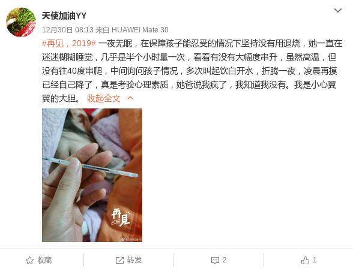

# 小心翼翼的大胆

* 12月27日，周五。一早醒来，发现我儿发烧，温度38度。在家陪伴了一天，让他多喝水，
  还是不见好转，最高的时候烧到39度。
* 12月28日，周六。给孩子用退烧药，但降下来后还是会再次烧上去。
* 12月29日，周日。带孩子去积水潭医院回龙观分院检查，是甲型流感。
  医生给开了一堆药，让孩子在家休息一周。医生说应该早一天去看，我们以为
  是普通的感冒，所以就没有及时带孩子去医院，怕交叉感染。
* 12月30日，周一。孩子的发烧基本控制住了，精神状态不错，就是流鼻涕。
  看到了E的微博，她的孩子正好也发烧。她对孩子的关心和我是类似的，我儿晚上一有
  动静我就会醒来问问他，神经过敏。我想，E和我其实是一类人吧。

